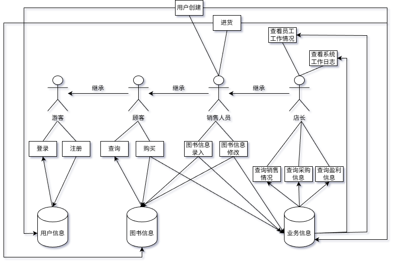
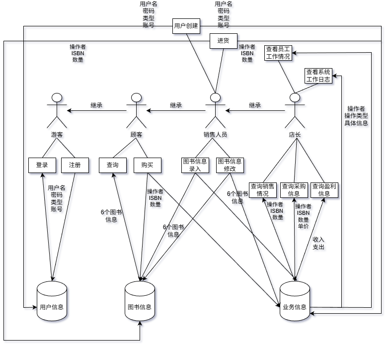

## 业务流图

## 数据流图

## 数据词典
### 用户信息：
- 账号：字符串，30位以内，包含数字、字母、下划线
- 密码：字符串，30位以内，包含数字、字母、下划线
- 用户名：字符串，30位以内，包含数字、字母、下划线
- 类型：一位整数，0、1、3、7分别代表游客、顾客、员工、店主
### 图书信息：
- ISBN 号：字符串，20位以内
- 书名：字符串，60位以内
- 作者：字符串，60位以内
- 关键字：可以有多个，字符串，总共60位以内
- 库存量：非负整数
- 单价：非负实数
### 业务信息：
- 操作者：字符串，20位以内，记录操作者的用户名
- 操作类型：整数，0~10分别代表以上11种操作
- 操作参数：具体见下
## 功能说明
### 用户注册：
输入账号、密码、用户名。

如果账号已经存在，则报告该账号已存在；否则完成注册。
### 用户登录：
输入账号、密码。

如果账号不存在或者与密码不匹配，报告账号或密码错误；否则完成登录。
### 修改密码：
输入密码、新密码。

如果账号与密码不匹配，报告密码错误；否则完成修改密码。
### 修改用户名：
输入密码、新用户名。

如果账号与密码不匹配，报告密码错误；否则完成修改用户名。
### 用户登出：
输入登出指令，退出登陆。
### 图书查询：
输入 ISBN 号、作者名字、关键字、书名中的任意组合。

返回查找到的书目信息。
### 图书购买：
输入 ISBN 号、购买数量。

如果库存不满足购买需求，报告库存不足；否则完成购买。
### 用户创建：
输入账号、密码、用户名、类型。

如果账号已经存在，则报告该账号已存在；否则创建用户。
### 图书信息录入：
输入 ISBN 号、作者名字、关键字、书名、价格、库存中的任意组合。

如果 ISBN 不与已有图书重复，完成图书信息录入；否则报告 ISBN 号已存在。
### 图书信息修改：
输入原 ISBN 号和新 ISBN 号、新作者名字、新关键字、新书名、新价格、新库存中的任意组合。

完成图书信息修改。
### 进货：
输入 ISBN 号、进货量、进价。

更新库存和成本。
### 查询采购信息：
按照采购顺序输出采购图书的 ISBN 号、数量、进价。
### 查询销售情况：
按照销售顺序输出售出图书的 ISBN 号、数量、单价、剩余库存。
### 查询盈利信息：
输出收入，支出以及利润。
### 查看员工工作情况：
输入员工账号。

按操作顺序输出每次操作类型、具体操作信息。
### 查看系统日志：
按操作顺序输出每次操作类型、操作者、具体操作信息。

## 用户交互设计
### 用户注册：
`sign_up [user_account] [password] [user_name]`

如果账号已经存在，报告`Account already exists`；否则`Successfully registered`。
### 用户登录：
`sign_in [user_account] [password]`

如果账号不存在或者与密码不匹配，报告`Account or password error`；否则`Successfully signed in`。
### 修改密码：
`change_password [password] [new_password]`

如果账号与密码不匹配，报告`Account or password error`；否则`Successfully changed password`。
### 修改用户名：
`change_user_name [user_name] [new_user_name]`

如果账号与密码不匹配，报告`Password error`；否则`Successfully changed user name`。
### 用户登出：
`sign_out`
### 图书查询：
`query (ISBN=[ISBN] | author=[author] | key=[key] | name=[book_name])`

返回查找到的书目信息，每一行格式为：
`book[id]: ISBN=[ISBN] author=[author] key=[key] name=[book_name] price=[price] stock=[stock]\n`
最后输出：
`Totally find [number] book(s)`

如果找不到符合条件的书，只输出`There are no books that meet the criteria`。
### 图书购买：
`buy ISBN=[ISBN] number=[number]`

如果库存不满足购买需求，报告`Insufficient stock`；否则`Successful purchased cost=[cost]`。
### 用户创建：
`create_user [user_account] [password] [user_name] [user_type]`

如果账号已经存在，则报告`Account already exists`；否则`Successfully registered`。
### 图书信息录入：
`enter_book_information ISBN=[ISBN] author=[author] key=[key] name=[book_name] price=[price] stock=[stock]`

如果 ISBN 不与已有图书重复，完成`Successfully entered book information`；否则``ISBN already exists``。
### 图书信息修改：
`modify_book_information ISBN=[ISBN] (new_ISBN=[new_ISBN] | author=[author] | key=[key] | name=[book_name] | price=[price] | stock=[stock])`

输出`Successfully modified book information`。
### 进货：
`stock ISBN=[ISBN] number=[number] cost=[cost]`

输出`Successfully updated inventory and costs`
### 查询采购信息：
按照采购顺序输出采购图书的 ISBN 号、数量、进价，每一行格式为：
`book[id] ISBN=[ISBN] number=[number] cost=[cost]`
最后输出：
`Totally find [number] stock information`
### 查询销售情况：
按照销售顺序输出售出图书的 ISBN 号、数量、单价、剩余库存，每一行格式为：
`book[id]: ISBN=[ISBN] number=[number] price=[price] stock=[stock]\n`
### 查询盈利信息：
输出`income=[income] outcome=[outcome] profit=[profit]`
### 查看员工工作情况：
`view_employee [user_account]`

按操作顺序输出每次操作类型、具体操作信息，每一行格式为：
`operation[id] operation_type=[operation_type] [Specific operational information...]`
最后输出：
`Totally find [number] operational information`
### 查看系统日志：
按操作顺序输出每次操作类型、操作者、具体操作信息，每一行格式为：
`operation[id] operation_type=[operation_type] user=[user_account] [Specific operational information...]`
最后输出：
`Totally find [number] operational information`